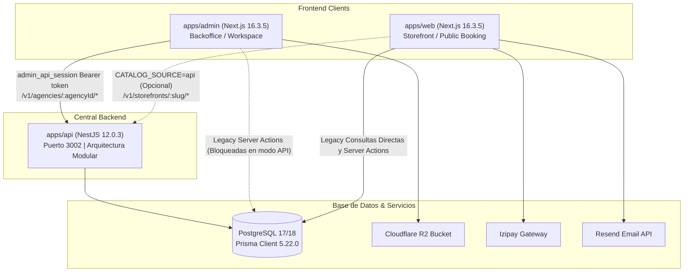

# Auditoría Técnica Inicial SaaS — 27 de septiembre de 2026

Referencia de auditoría: Inspección profunda estática y dinámica sobre el repositorio `agencia-de-viajes`.

---

## 1. Project Understanding

La aplicación (**IncaBound / Agencia de Viajes**) es una plataforma SaaS B2B/B2C diseñada para agencias de turismo receptivo y de aventura en Perú (con foco principal en Cusco y destinos andinos).

El sistema atiende dos perfiles de usuario:
1. **Viajeros finales (B2C)**: Consultan el catálogo de tours y traslados de aeropuerto, seleccionan modalidades de servicio (compartido vs. privado por capacidad vehicular), aplican cupones de descuento, cotizan precios autoritativos calculados en servidor en centavos (unidades menores en USD), registran datos de pasajeros y procesan pagos con tarjeta mediante la pasarela de pagos Izipay.
2. **Personal y operadores de agencias (B2B)**: Gestionan su espacio de trabajo multi-tenant, administran y publican itinerarios, galerías, preguntas frecuentes y tarifas vehiculares privadas, gestionan cotizaciones y reservas manuales con bloqueo de concurrencia optimista (`expectedUpdatedAt`), trazan auditoría operativa y financiera, y administran membresías de equipo mediante control de acceso basado en roles (RBAC).

El proyecto se encuentra en una fase de transición arquitectónica: pasando de un monolito Next.js mono-agencia con acceso directo a PostgreSQL hacia un SaaS desacoplado multi-agencia donde una **API central en NestJS** actúa como autoridad de dominio, aislamiento multi-tenant, autenticación estricta, cotización y lógica transaccional.

---

## 2. Technology Stack

Tecnologías verificadas directamente en código fuente y configuraciones:

- **Monorepo & Build System**: [Turborepo 2.10.3](file:///c:/Users/ADRIANO/Desktop/agencia-de-viajes/turbo.json), [pnpm 12.0.0](file:///c:/Users/ADRIANO/Desktop/agencia-de-viajes/pnpm-workspace.yaml)
- **Runtime & Lenguaje**: Node.js `v24.16.0` (motores declaran `>=22.13.0`), TypeScript `5.9.2`
- **Backend API Framework**: [NestJS 12.0.3](file:///c:/Users/ADRIANO/Desktop/agencia-de-viajes/apps/api/package.json) (`@nestjs/common`, `@nestjs/core`, `@nestjs/platform-express`, `@nestjs/swagger`, `@nestjs/throttler`)
- **Frontend Frameworks**: [Next.js 16.3.5](file:///c:/Users/ADRIANO/Desktop/agencia-de-viajes/apps/web/package.json) (App Router, Turbopack, standalone output) tanto para `apps/web` como para `apps/admin`
- **UI & Estilos**: React 19.2.0, Tailwind CSS 3.4.19, Lucide React, Base UI, Recharts, `nuqs`
- **Base de Datos & ORM**: PostgreSQL 17/18, [Prisma ORM 5.22.0](file:///c:/Users/ADRIANO/Desktop/agencia-de-viajes/packages/db/prisma/schema.prisma) en `@repo/db`
- **Autenticación**:
  - *SaaS API*: Tokens opacos de sesión de 32 bytes en base64url, hashing SHA-256 en base de datos (`ApiSession`), Bcrypt (`bcryptjs 3.0.3`), control de expiración (1 hora) y pertenencia mediante `AgencyMembership`
  - *Admin Legado*: JWT HS256 mediante `jose 6.2.4` en cookie `admin_session`
- **Almacenamiento de Archivos**: Cloudflare R2 vía AWS S3 SDK (`@aws-sdk/client-s3 3.1092.0`)
- **Pasarela de Pagos**: Izipay (Perú), validación de firma criptográfica HMAC-SHA256
- **Servicio de Correo**: Resend (`resend 6.18.0`)
- **Validación de Datos**: Zod 4.4.3
- **Pruebas Automatizadas**: Vitest 4.1.11 (96 pruebas unitarias), Node.js Test Runner nativo (`node:test`, 22 pruebas e2e HTTP en API), Supertest 7.2.2

---

## 3. Architecture

El repositorio está organizado como un monorepo con tres aplicaciones y cuatro paquetes de soporte:

### Capas del Sistema:
1. **[apps/api](file:///c:/Users/ADRIANO/Desktop/agencia-de-viajes/apps/api)**: API REST centralizada en NestJS versionada (`/v1`). Implementa resolución multi-tenant con [TenantInterceptor](file:///c:/Users/ADRIANO/Desktop/agencia-de-viajes/apps/api/src/tenant/tenant.interceptor.ts), autorización con [AccessGuard](file:///c:/Users/ADRIANO/Desktop/agencia-de-viajes/apps/api/src/security/public-route.ts), rate-limiting con `ThrottlerGuard`, cotización autoritativa en centavos y outbox transaccional.
2. **[apps/admin](file:///c:/Users/ADRIANO/Desktop/agencia-de-viajes/apps/admin)**: Aplicación administrativa en modo dual:
   - **Modo SaaS Workspace** (`ADMIN_AUTH_MODE="api"`): Gestionado por [proxy.ts](file:///c:/Users/ADRIANO/Desktop/agencia-de-viajes/apps/admin/proxy.ts), delega toda la autenticación y operaciones a NestJS mediante [centralRequest](file:///c:/Users/ADRIANO/Desktop/agencia-de-viajes/apps/admin/lib/central-api.ts) en las rutas `/workspace/*`.
   - **Modo Legado** (`ADMIN_AUTH_MODE="legacy"`): Acceso directo a base de datos sin aislamiento de agencia mediante server actions antiguas.
3. **[apps/web](file:///c:/Users/ADRIANO/Desktop/agencia-de-viajes/apps/web)**: Tienda pública de reservas. Admite consumo de catálogo desde NestJS (`CATALOG_SOURCE=api`), pero conserva endpoints de checkout, megamenú y páginas que consultan directamente a PostgreSQL sin contexto de agencia.
4. **[packages/db](file:///c:/Users/ADRIANO/Desktop/agencia-de-viajes/packages/db)**: Esquema de Prisma, historial de 4 migraciones, scripts de seeding y utilidades compartidas.

---

## 4. Existing Functional Modules

| Módulo | Clasificación | Estado y Observaciones |
| :--- | :--- | :--- |
| **Salud y Telemetría API** | **Working** | Endpoints `/v1/health` y `/v1/health/ready` con ID de petición, tiempo activo y verificación de BD. Verificado con [http.e2e.mjs](file:///c:/Users/ADRIANO/Desktop/agencia-de-viajes/apps/api/test/http.e2e.mjs). |
| **Catálogo Público de Agencia (API)** | **Working** | `/v1/storefronts/:storefront/tours` y `/transfers` filtrados estrictamente por slug de agencia activa y estado `isPublished: true`. Totalmente probado y aislado. |
| **Autenticación y Sesiones SaaS (API)** | **Working** | `/v1/auth/login`, `/me`, `/logout`. Tokens opacos de 32 bytes con hash SHA-256, expiración a 1 hora, bloqueo por reintentos fallidos, verificación de membresía y revocación inmediata. |
| **Workspace Administrativo SaaS** | **Working** | Rutas `/workspace`, `/workspace/content`, `/workspace/resources`, `/workspace/reservations`. Operación exclusiva vía NestJS API con Server Actions seguras, tipadas con Zod y aisladas por `agencyId`. |
| **Reservas Manuales y Cotización (API)** | **Working** | Implementado en [ReservationsService](file:///c:/Users/ADRIANO/Desktop/agencia-de-viajes/apps/api/src/reservations/reservations.service.ts). Cotización autoritativa con `quoteHash`, paginación por cursor, control de concurrencia optimista (`expectedUpdatedAt`), historial de eventos y auditoría transaccional. |
| **Catálogo Web Storefront (Híbrido)** | **Partial** | [tour.ts](file:///c:/Users/ADRIANO/Desktop/agencia-de-viajes/apps/web/lib/queries/tour.ts) soporta `CATALOG_SOURCE=api`, pero portada, megamenús, blog y sitemap siguen atacando PostgreSQL de forma global. |
| **Checkout y Pagos (API)** | **Partial** | Implementado en [CheckoutService](file:///c:/Users/ADRIANO/Desktop/agencia-de-viajes/apps/api/src/checkout/checkout.service.ts) y [PaymentsService](file:///c:/Users/ADRIANO/Desktop/agencia-de-viajes/apps/api/src/payments/payments.service.ts) con centavos e idempotencia, pero deshabilitado en [app.module.ts](file:///c:/Users/ADRIANO/Desktop/agencia-de-viajes/apps/api/src/app.module.ts) salvo en `NODE_ENV=test`. |
| **Checkout Web Storefront (Legado)** | **Broken / Unsafe** | [actions/reservation.ts](file:///c:/Users/ADRIANO/Desktop/agencia-de-viajes/apps/web/app/actions/reservation.ts) crea reservas con `agencyId: null`, quema cupones antes del pago y el IPN no valida el monto pagado frente a `totalPrice`. |
| **Subida de Archivos R2** | **Broken in API Mode** | [upload/route.ts](file:///c:/Users/ADRIANO/Desktop/agencia-de-viajes/apps/admin/app/api/upload/route.ts) usa [verifyAdminSession](file:///c:/Users/ADRIANO/Desktop/agencia-de-viajes/apps/admin/lib/auth-check.ts), que retorna `null` en modo API, impidiendo subir imágenes desde el workspace. |
| **Rutas Administrativas Legadas** | **Needs Verification / Deprecated** | Acciones en [user.ts](file:///c:/Users/ADRIANO/Desktop/agencia-de-viajes/apps/admin/app/actions/user.ts) y [reservation.ts](file:///c:/Users/ADRIANO/Desktop/agencia-de-viajes/apps/admin/app/actions/reservation.ts) no filtran por agencia. Bloqueadas en modo API, pero vulnerables si se desactiva. |

---

## 5. Database

### Estructura y Migraciones
El esquema de Prisma ([schema.prisma](file:///c:/Users/ADRIANO/Desktop/agencia-de-viajes/packages/db/prisma/schema.prisma)) cuenta con 41 modelos y 4 migraciones versionadas:
1. `00000000000000_baseline`: Esquema inicial completo.
2. `20260921000000_api_memberships`: Creación de [AgencyMembership](file:///c:/Users/ADRIANO/Desktop/agencia-de-viajes/packages/db/prisma/schema.prisma#L225) y [ApiSession](file:///c:/Users/ADRIANO/Desktop/agencia-de-viajes/packages/db/prisma/schema.prisma#L254).
3. `20260922000000_catalog_publication`: Agrega `isPublished` a `Tour` y `Transfer`, y soporte multi-agencia a `VehicleType`.
4. `20260923000000_manual_reservations`: Importes en unidades menores (`totalMinor`, `unitPriceMinor`, `paidMinor`), estados operacionales (`operationStatus`, `bookingStatus`, `paymentStatus`), `ReservationEvent` y `OperationalAudit`.

### Verificación en Base de Datos Real
- **Agencias activas**: 1 agencia (`Inca Bound Expeditions`, slug: `incabound`).
- **Estado de publicación del catálogo**:
  - Tours: 10 tours registrados; **0 publicados**, **10 en borrador**.
  - Traslados: 10 traslados registrados; **0 publicados**, **10 en borrador**.
  *(Al estar todos en borrador, la tienda pública y la API pública muestran 0 servicios disponibles hasta su publicación).*
- **Registros históricos / huérfanos**:
  - 13 reservas históricas tienen `agencyId: null` (preservadas e ignoradas por el SaaS).
  - Los 4 tipos de vehículos (`sedan`, `minivan`, `benz-10`, `benz-15`) tienen `agencyId: null`. Dado que NestJS exige `p.vehicle.agencyId === agencyId`, ningún traslado privado puede cotizarse ni publicarse con vehículos hasta asociarlos o crearlos por agencia.
- **Arranque seguro**: `package.json` ya no ejecuta `prisma db push` ni seeds en `start`, garantizando que el arranque no sobreescriba datos.

---

## 6. Authentication & Authorization

### Arquitectura Actual
1. **NestJS API**:
   - Autenticación en [AuthService](file:///c:/Users/ADRIANO/Desktop/agencia-de-viajes/apps/api/src/auth/auth.service.ts). Cabecera `Authorization: Bearer <token>`.
   - Autorización por [AccessGuard](file:///c:/Users/ADRIANO/Desktop/agencia-de-viajes/apps/api/src/security/public-route.ts). Las rutas son privadas por defecto.
   - Validación de pertenencia: `request.params.agencyId === request.identity.agencyId` y verificación de roles (`OWNER`, `ADMIN`, `OPERATOR`, `EDITOR`, `VIEWER`).
2. **Next.js Admin**:
   - En `ADMIN_AUTH_MODE="api"`, `/login` autentica contra NestJS `/v1/auth/login` y guarda el token en la cookie HttpOnly `admin_api_session`.
   - [proxy.ts](file:///c:/Users/ADRIANO/Desktop/agencia-de-viajes/apps/admin/proxy.ts) restringe la navegación exclusivamente a `/workspace/*`.
   - Si `ADMIN_AUTH_MODE` no está definido en el entorno, cae en fallback a `'legacy'`. En `.env.example` esta variable no está presente, lo que podría exponer el modo legado si se omite en nuevos despliegues.

---

## 7. External Integrations

| Proveedor | Servicio / Función | Estado de Configuración |
| :--- | :--- | :--- |
| **PostgreSQL** | Base de datos principal | Configurado en `DATABASE_URL` (instancia en Oracle Cloud). Conectividad verificada (`DB_OK`). |
| **Cloudflare R2** | Almacenamiento de imágenes | Variables `R2_ACCOUNT_ID`, `R2_ACCESS_KEY_ID`, `R2_SECRET_ACCESS_KEY`, `R2_BUCKET_NAME`, `R2_PUBLIC_DOMAIN`. |
| **Izipay** | Pasarela de tarjetas Perú | Variables `NEXT_PUBLIC_IZIPAY_PUBLIC_KEY`, `IZIPAY_SHOP_ID`, `IZIPAY_TEST_PASSWORD`, `IZIPAY_HMAC_SHA256`, `IZIPAY_API_URL`. |
| **Resend** | Envíos transaccionales de confirmación | Variables `RESEND_API_KEY` y `EMAIL_FROM`. |

---

## 8. Security Findings

### P0 — Crítico
1. **Fuga Multi-Tenant en Checkout de la Web Storefront**:
   - En [apps/web/app/actions/reservation.ts](file:///c:/Users/ADRIANO/Desktop/agencia-de-viajes/apps/web/app/actions/reservation.ts#L273), la creación de `Reservation` no asigna `agencyId`. Las reservas creadas quedan huérfanas (`agencyId: null`) e invisibles para la agencia correspondiente en el workspace.
2. **Omisión de Validación de Monto en IPN de Izipay (Web)**:
   - En [apps/web/app/api/payments/izipay/ipn/route.ts](file:///c:/Users/ADRIANO/Desktop/agencia-de-viajes/apps/web/app/api/payments/izipay/ipn/route.ts#L42-L51), al recibir `orderStatus === 'PAID'`, la reserva se actualiza a `PAID` sin comprobar que `answer.orderDetails.orderTotalAmount` coincida con `reservation.totalPrice * 100`.
3. **Quema Prematura de Cupones de Descuento**:
   - En [apps/web/app/actions/reservation.ts](file:///c:/Users/ADRIANO/Desktop/agencia-de-viajes/apps/web/app/actions/reservation.ts#L250-L253), el contador `timesUsed` del cupón se incrementa al generar la intención de reserva, antes del pago. Un usuario que abandona la pasarela consume el cupón irreversiblemente.

### P1 — Alto
1. **Buffer de Memoria no Limitado en Upload de Imágenes**:
   - En [apps/admin/app/api/upload/route.ts](file:///c:/Users/ADRIANO/Desktop/agencia-de-viajes/apps/admin/app/api/upload/route.ts#L26-L27), se ejecuta `await file.arrayBuffer()` sin límite de tamaño ni verificación de tipo MIME real por magic bytes (riesgo de OOM/DoS). Además, está roto en modo API porque `verifyAdminSession` devuelve `null`.
2. **Vulnerabilidades en Dependencias**:
   - `pnpm audit` detecta 61 vulnerabilidades (35 High, 25 Moderate, 1 Low), concentradas principalmente en dependencias de desarrollo/CLI (`shadcn` arrastrando `@modelcontextprotocol/sdk` y `hono`, y `adm-zip` en raíz).

### P2 — Medio
1. **Catálogo Totalmente en Borrador**:
   - Los 10 tours y 10 traslados tienen `isPublished: false`. La tienda pública no muestra servicios hasta que sean revisados y publicados desde el workspace.
2. **Vehículos Huérfanos sin Agencia**:
   - Los 4 tipos de vehículos tienen `agencyId: null`. La validación en NestJS bloquea la selección de vehículos cuya agencia no coincida con la del traslado.
3. **Variables Ausentes en `.env.example`**:
   - Faltan `ADMIN_AUTH_MODE`, `ADMIN_API_URL`, `API_AUTH_ENABLED`, `API_HOST`, `API_PORT` y `API_PUBLIC_AGENCY_SLUGS`, lo que favorece configuraciones erróneas en nuevos entornos.

### P3 — Bajo
1. **Umbral de Advertencias en Lint**:
   - `pnpm lint` falla debido a 84 advertencias en `apps/web` evaluadas bajo `--max-warnings 0`.

---

## 9. Performance Findings

1. **Cascada N+1 en Consulta de Autenticación de NestJS**:
   - En [AuthService.authenticate](file:///c:/Users/ADRIANO/Desktop/agencia-de-viajes/apps/api/src/auth/auth.service.ts#L55-L58), `prisma.apiSession.findUnique` incluye `membership`, `user` y `agency`. Prisma 5.22 ejecuta 4 consultas SQL independientes por cada petición autenticada.
2. **Doble Viaje en Carga SSR de Admin Workspace**:
   - Durante la renderización en servidor de Next.js admin, [centralSession()](file:///c:/Users/ADRIANO/Desktop/agencia-de-viajes/apps/admin/lib/central-api.ts#L53) invoca `/v1/auth/me` (4 consultas a BD), y luego la carga de datos del workspace ejecuta la petición de datos (otras 4 consultas en el guard + 1 de datos), sumando ~9 viajes a PostgreSQL remoto (~1.200 ms de latencia total).

---

## 10. Technical Debt

1. **Doble Motor de Checkout y Pagos**:
   - Coexisten el motor robusto y probado de NestJS ([checkout.service.ts](file:///c:/Users/ADRIANO/Desktop/agencia-de-viajes/apps/api/src/checkout/checkout.service.ts)) y el flujo legado sin agencia en [apps/web/app/actions/reservation.ts](file:///c:/Users/ADRIANO/Desktop/agencia-de-viajes/apps/web/app/actions/reservation.ts).
2. **Vistas Administrativas Legadas**:
   - Coexisten las vistas antiguas bajo `app/(dashboard)` junto al nuevo espacio `/workspace`.
3. **Deuda de ESLint en `apps/web`**:
   - 84 advertencias de ESLint impiden habilitar el linting estricto en CI.

---

## 11. Production Blockers

1. **Fallas de Seguridad en Checkout e IPN (P0)**: Reservas sin `agencyId`, quema prematura de cupones y falta de verificación de monto en IPN.
2. **Catálogo 100% en Borrador**: La tienda no exhibe productos a los viajeros.
3. **Tipos de Vehículos sin Agencia**: Bloquean la contratación de traslados privados.
4. **Subida de Archivos R2 Inoperativa en Modo API**: Los redactores no pueden cargar imágenes a Cloudflare R2 desde el workspace.
5. **Vulnerabilidades de Dependencias en Monorepo**: Avisos de severidad alta en paquetes del lockfile.

---

## 12. Recommended Next Steps

1. **Paso 1 (P0)**: Adecuar el Checkout e IPN de la web para consumir la API de NestJS o asegurar `agencyId` estricto, verificación de importe en IPN y quema atómica de cupones confirmados.
2. **Paso 2 (P1)**: Habilitar y proteger el endpoint de subida de imágenes a Cloudflare R2 para sesiones API, con validación de tamaño y MIME.
3. **Paso 3 (P1/P2)**: Asignar los vehículos existentes a `incabound` y publicar los tours y traslados pertinentes desde el workspace.
4. **Paso 4 (P2)**: Optimizar la autenticación en [AuthService.authenticate](file:///c:/Users/ADRIANO/Desktop/agencia-de-viajes/apps/api/src/auth/auth.service.ts) mediante `relationJoins` de Prisma o SQL parametrizado para abatir la latencia de 4 a 1 viaje a la BD.
5. **Paso 5 (P2/P3)**: Limpiar advertencias de ESLint en `apps/web` para garantizar pipelines de CI con umbral cero.

---
*Fin del informe de auditoría. En espera de la revisión y priorización del SaaS Manager.*
