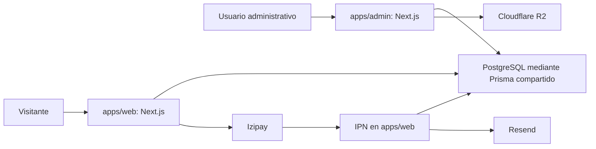

# Auditoría técnica para convertir el proyecto en SaaS

Fecha: 20 de septiembre de 2026. Referencia del repositorio: `b9c8732`.

**Dictamen: el proyecto tiene una base funcional aprovechable, pero no está preparado para alojar agencias independientes con garantías de aislamiento y operación.** Los bloqueos principales están en autorización, pagos, despliegue y separación de datos. Cambiar el framework por sí solo no los resuelve.

La recomendación, incorporando el requisito confirmado de frontends independientes y conexión de sitios existentes, es adoptar NestJS como backend central con API desde la primera versión SaaS. Conservar Next.js/React para las interfaces actuales y PostgreSQL, corregir primero los bloqueos y extraer gradualmente el dominio. No se recomienda una reescritura inmediata a Vue. El [plan de arquitectura y ejecución](./PLAN-SAAS-Y-TECNOLOGIAS.md) desarrolla la decisión.

El usuario confirmó un SaaS para varias agencias independientes, frontends propios por agencia e integración de webs existentes mediante API, con alojamiento disponible en Oracle. Su experiencia está en marketing y UI/UX, sin dominio previo de Next, Nest o Vue. No se ha confirmado equipo técnico, presupuesto, volumen, recursos de Oracle ni quién cobrará a los viajeros. La separación de backend está justificada por esos consumidores externos; conservar el frontend actual limita el alcance de la migración.

## Alcance y evidencia

Inventario de 289 archivos versionados, 208 archivos TypeScript/TSX, aproximadamente 30.718 líneas no vacías en esos archivos y 41 modelos Prisma. Se inspeccionaron estructura, dependencias, esquema, autenticación, acciones administrativas, checkout, callbacks, consultas, almacenamiento, correo, configuración y pruebas. La revisión de interfaz es estática y por flujos; no equivale a una evaluación visual o de accesibilidad en navegador.

No se ejecutaron seeds, migraciones, cobros, envíos de mensajes ni cambios en datos. No se imprimió el contenido de archivos `.env`. La auditoría no verifica el historial completo de secretos, permisos del proveedor cloud, backups existentes fuera del repositorio ni incidentes pasados. Las referencias `archivo:línea` corresponden a esta revisión.

| Verificación ejecutada | Resultado | Límite de interpretación |
| --- | --- | --- |
| `pnpm test` | 5 archivos, 32 pruebas aprobadas | Pruebas unitarias; sin E2E, aislamiento de agencias o pagos integrados |
| `pnpm check-types` | Aprobado | Varias consultas usan `any`; `@repo/db` no tiene script propio de comprobación |
| `pnpm lint` | Falló | 102 advertencias web y 258 admin; el umbral es cero |
| `pnpm --filter web build` | Aprobado con errores de lectura de contenido capturados | Se forzó una URL de BD local inaccesible; no valida funcionamiento con datos |
| `pnpm --filter admin build` | Aprobado | Mismo aislamiento de BD; las rutas dinámicas no se ejercitan mediante este build |
| `pnpm audit --json` | 89 avisos: 2 críticos, 49 altos, 35 moderados y 3 bajos | Coincidencias de dependencias; no son 89 vulnerabilidades explotadas o confirmadas en producción |

Entorno de comprobación: Windows, Node `24.16.0`, pnpm `12.0.0`. Docker declara Node 22. Next instalado: `16.2.0`; Prisma generado: `5.22.0`. El árbol de trabajo estaba limpio al comenzar.

El primer build con Turbo se interrumpió para ejecutar ambos builds directamente por aplicación y garantizar que la variable de aislamiento de BD llegara a Next, independientemente del filtrado de variables de Turbo. Ningún resultado de ese intento se usa como validación final.

## Arquitectura encontrada

Hay dos aplicaciones completas con acceso directo a la misma base. Las Server Actions y páginas contienen buena parte de las reglas comerciales. `@repo/db` mezcla cliente Prisma, tipos, validación, autenticación y datos iniciales. `@repo/ui` conserva componentes de ejemplo y utilidades, mientras las aplicaciones mantienen sus propios componentes.

| Área | Estado observado |
| --- | --- |
| Catálogo, blogs, transporte | CRUD y pantallas implementados; permisos demasiado amplios y alcance global |
| Reservas y pasajeros | Flujo legado operativo a nivel de código; faltan garantías de concurrencia, inventario e idempotencia |
| Pago de viajeros | Integración Izipay, HMAC y actualización condicional presentes; conciliación incompleta |
| Usuarios y roles | JWT, bcrypt y guards; falta verificar estado vigente del usuario |
| Agencias | Modelo y seed presentes; no hay resolución del tenant en las aplicaciones |
| Suscripciones SaaS | Sin planes, suscripciones, límites ni ciclo de cobro SaaS implementados |
| Onboarding, dominios y marca por agencia | Campos parciales; sin flujo completo de alta, verificación y configuración |
| Auditoría | Logs administrativos parciales; tablas financieras nuevas sin conexión con el flujo de pago activo |
| Contacto y campañas | Interfaces presentan éxito sin entrega real |
| Operación | Docker/Railway básicos; sin CI, migraciones versionadas ni procedimientos de recuperación en el repo |

Se debe conservar lo que sí está bien: precios de tours recalculados en servidor, validación Zod en varios puntos, cookies HttpOnly/Secure en producción, firma JWT, comparación HMAC en tiempo constante, callback del navegador sin autoridad para marcar pago, transición IPN condicional y algunas escrituras anidadas/transacciones.

## Hallazgos que bloquean el lanzamiento

Prioridad P0: corregir antes de exposición o uso afectado. P1: resolver antes del piloto SaaS con datos reales. P2: completar durante la preparación operativa y el crecimiento. Estas prioridades son de ejecución; no sustituyen una puntuación CVSS.

### A01 — P0 — No existe aislamiento efectivo entre agencias

Evidencia: `packages/db/prisma/schema.prisma:56`, `apps/admin/app/actions/user.ts:20`, `apps/web/app/actions/reservation.ts:112`, `apps/web/lib/queries/tour.ts:17`. La búsqueda de `agencyId|tenant` en las aplicaciones y `packages/db/src` no encontró implementación de contexto de agencia. El JWT tampoco incluye membresía/agencia.

Escenario: con dos agencias en la misma BD, las consultas administrativas y del catálogo siguen siendo globales; escrituras por ID y slug no verifican propietario. Las nuevas reservas y usuarios no reciben `agencyId`. La presencia de `Agency` no ofrece aislamiento.

Corrección: contexto de agencia obligatorio, membresías, permisos por recurso y repositorios acotados. Un host desconocido debe fallar cerrado. Añadir pruebas A/B de lectura, escritura, relaciones, exportación, medios y jobs. No habilitar una segunda agencia antes de superarlas.

### A02 — P0 — El arranque raíz puede sobrescribir y borrar datos comerciales

Evidencia: `package.json:7` y `:9`, `packages/db/package.json:11`, `packages/db/seed-tours.ts:38` y `:71`, `seed-blogs.ts:266` y `:295`, `seed-transfers.ts:40`.

`pnpm start` ejecuta `db push` y todos los seeds. Estos reemplazan contenidos y eliminan tours, blogs y traslados que no pertenecen a sus listas iniciales. Las restricciones referenciales pueden bloquear algunos borrados, pero no hacen seguro el procedimiento ni revierten operaciones anteriores independientes. Aplica a despliegues que utilicen el start raíz; los CMD de Docker arrancan cada aplicación directamente.

Corrección: arranque sin escrituras de datos, migraciones versionadas en un job único de release y seeds exclusivos de desarrollo. Ensayar restauración antes de cualquier transición. Nunca usar `db:push:ci --accept-data-loss` en producción.

### A03 — P0 — Credenciales de seed predefinidas, reactivación y exposición en logs

Evidencia: `packages/db/seed-admin.ts:10` en adelante y su bloque de impresión final; `apps/admin/app/api/seed/route.ts:6`.

El seed usa contraseñas conocidas como fallback y sus upserts reemplazan contraseñas, roles y estado activo de cuentas existentes. Además imprime las contraseñas, incluidas las suministradas por entorno. `/api/seed` requiere MASTER/SUPERADMIN, pero crea cuentas con credenciales fijas mediante GET y carece de bloqueo de producción.

Corrección: retirar ese endpoint del producto; bootstrap inicial de un solo uso con secreto externo o invitación; nunca restablecer cuentas al reiniciar ni imprimir contraseñas. Si se ejecutó en producción, revisar acceso a logs y rotar las credenciales expuestas. No se afirma que ya haya ocurrido una intrusión.

### A04 — P0 — Next.js instalado coincide con avisos críticos oficiales

Evidencia: `apps/web/package.json`, `apps/admin/package.json`, `pnpm-lock.yaml` y ejecución de audit. Next `16.2.0` figura en rangos afectados por dos avisos críticos publicados el 25/08/2026; ambos señalan `16.3.3` como versión corregida de la rama 16.

Uno afecta optimización de imágenes AVIF; el otro servidores alojados en Windows. El proyecto habilita optimización de imágenes y el admin permite cualquier hostname HTTPS, por lo que es prioritario evaluar la primera superficie. La segunda depende del sistema del servidor: el Dockerfile Linux no queda afectado por ese requisito específico. No se intentó explotar ninguna. Fuentes: [aviso AVIF](https://github.com/vercel/next.js/security/advisories/GHSA-2xp9-vwfh-vxw4), [aviso Windows](https://github.com/vercel/next.js/security/advisories/GHSA-p293-qw3h-jr36).

Corrección: actualizar coordinadamente a una versión estable corregida —como mínimo la indicada para estos avisos—, revisar también `sharp` y dependencias transitivas, y repetir checkout, imágenes, autenticación y builds. Reducir el allowlist del optimizador. El resto de los 89 avisos necesita clasificación por alcance; dependencias de herramientas como `shadcn` están declaradas dentro de producción.

### A05 — P0 — La revocación de sesiones no se aplica al validar peticiones

Evidencia: `apps/admin/lib/auth-check.ts:6`, `apps/admin/lib/jwt.ts:52`, `packages/db/src/auth-security.ts:124` y `apps/admin/app/actions/user.ts:187`.

El guard verifica firma y expiración, pero no consulta `isActive`, rol actual, `tokenVersion` o revocación. Aumentar `tokenVersion`, cambiar contraseña, eliminar o desactivar al usuario no invalida el JWT ya emitido ante estos guards. El acceso previo puede continuar hasta su expiración de ocho horas.

Corrección: validar usuario/sesión vigente en la capa que accede a datos, con caché breve y revocación coherente si se usa caché. Logout debe revocar la sesión de servidor cuando se requiera invalidar el token copiado. Probar revocación y cambio de rol sobre un token emitido antes del cambio.

### A06 — P0 — Datos personales de reservas accesibles solo con conocer el ID

Evidencia: `apps/web/app/reserva/[id]/resultado/page.tsx:34` y `:52`.

La página pública consulta por ID sin credencial ni token de acceso y entrega al cliente correo, teléfono, hotel, documentos de pasajeros y `paymentReference`. Mientras está pendiente, ese último campo almacena el formToken del pago. Los CUID dificultan adivinar IDs, pero no autorizan el acceso y no protegen frente a enlaces filtrados o compartidos.

Corrección: acceso firmado/aleatorio de alta entropía con hash, vencimiento, alcance y revocación, o sesión del comprador; DTO mínimo sin documentos completos ni referencia interna del pago. Los modelos `ReservationAccess`/`accessTokenHash` existentes no están conectados al flujo revisado.

### A07 — P0 — XSS almacenado posible en JSON-LD del catálogo

Evidencia: `apps/web/app/tours/[slug]/page.tsx:210`, `apps/web/app/blog/[slug]/page.tsx:117`; títulos e itinerarios se almacenan como strings desde las acciones de contenido.

`JSON.stringify` se inserta directamente en `dangerouslySetInnerHTML` dentro de `<script>`. Texto de contenido con un cierre de script puede salir de ese contexto. Requiere capacidad de escribir contenido; los permisos amplios de A08 aumentan el alcance. Es un hallazgo de flujo de código, sin explotación en navegador o BD.

Corrección: serialización segura de JSON-LD, escapando al menos `<` como `\u003c`, prueba con contenido adversarial y CSP compatible con la pasarela como defensa adicional. La [guía oficial de Next.js](https://nextjs.org/docs/app/guides/json-ld) advierte expresamente sobre este patrón.

### A08 — P1 — Los roles declarados no corresponden a los permisos reales

Evidencia: `apps/admin/app/actions/tour.ts:20`, `blog.ts:55`, `transporte.ts:25`, `reservation.ts:54`, `:81` y `:205`.

Numerosas acciones de contenido, vehículos y reservas solo exigen sesión. Un usuario MARKETING o CONTENT_CREATOR puede invocar operaciones fuera de su función, incluida creación manual con estado PAID. Las páginas de reservas/dashboard consultan datos sin permiso específico por módulo; ocultar enlaces en el sidebar no lo impide.

Corrección: matriz de permisos ejecutada en servidor para lecturas y mutaciones, con agencia y propiedad del recurso. Centralizar casos de uso y probar denegaciones, no solo guards aislados.

### A09 — P1 — MASTER puede alterar el estado de un SUPERADMIN por una ruta alternativa

Evidencia: `apps/admin/app/actions/user.ts:223` y `:268`. `toggleUserStatusAction` y `unlockUserAccountAction` no repiten la protección de SUPERADMIN que sí tienen actualización y eliminación.

Un MASTER que conozca el ID puede desactivar/reactivar o desbloquear una cuenta de plataforma. El filtro de la lista de usuarios no sustituye esa protección.

Corrección: autorización central sobre actor, acción y usuario objetivo; separar roles de plataforma de membresías de agencia. Añadir estos casos a la matriz de denegaciones.

## Integridad de reservas y pagos

### A10 — P1 — Confirmación de pago incompleta y estados divergentes

Evidencia: `apps/web/app/api/payments/izipay/ipn/route.ts:35`–`:51`; `packages/db/prisma/schema.prisma:537`; `apps/admin/app/actions/reservation.ts:27`.

El IPN firmado marca PAID usando `orderId` y estado, sin cotejar monto, moneda, cuenta comercial o entorno con una intención de pago persistida. Trata AUTHORIZED como PAID, cuya semántica debe confirmarse con la modalidad contratada. La escritura solo actualiza `Reservation.status`; deja `bookingStatus`, `paymentStatus` y `paidMinor` en otros valores. Cambios manuales tampoco llevan una auditoría financiera transaccional.

Corrección: un solo servicio de transición, importes/moneda/cuenta validados, registro único por evento/transacción, política explícita de autorización/captura, y tratamiento de discrepancias. Confirmar también formato del IPN: el handler solo acepta JSON, mientras el callback usa formulario. Esto último es una comprobación pendiente contra el contrato y payload real de Izipay, no un fallo de producción demostrado.

### A11 — P1 — Checkout no idempotente y consumo de cupones fuera de transacción

Evidencia: `apps/web/app/actions/reservation.ts:219`, `:248`, `:271` y `:340`.

Se lee disponibilidad del cupón, se incrementa su uso, se crea reserva y después se llama a Izipay. Si falla la reserva o pasarela, el uso puede quedar consumido. Dos peticiones pueden observar el último uso disponible simultáneamente y ambas consumirlo. Reintentar el checkout crea otra reserva; no hay clave de idempotencia activa. El código basado en `Date.now()` también puede colisionar.

Corrección: intención de checkout con clave única por agencia y huella de contenido, reserva atómica del cupón, expiración/liberación y confirmación al pago. No mantener una transacción SQL abierta durante llamadas de red. Registrar intento antes de llamar al proveedor y conciliar resultados ambiguos.

### A12 — P1 — Se pueden comprar modalidades o traslados no disponibles

Evidencia: `apps/web/app/actions/reservation.ts:166`–`:185`.

Para tours compartidos se verifica precio, pero no `hasSharedService`. En traslados no se comprueba `isActive`, habilitación de modalidad, estado/capacidad del vehículo ni correspondencia estricta del vehículo solicitado. Si no coincide, se usa el primer vehículo; faltando tarifa, se inventan importes de 20 o 10.

Corrección: rechazar combinaciones no configuradas; calcular con reglas únicas compartidas por cotización y pago. Añadir límites de pasajeros, vehículos, importes y pruebas de servicios desactivados.

### A13 — P1 — Capacidad, fechas y pasajeros no se validan de extremo a extremo

Evidencia: `apps/web/app/actions/reservation.ts:22`, `:38`, `:199`; `packages/db/prisma/schema.prisma:299`.

No hay uso operativo de `TourAvailability`, bloqueo de cupos ni reservas temporales. Las fechas se aceptan como strings y no se rechazan sistemáticamente fechas pasadas o inválidas; tampoco se exige correspondencia de pasajeros con cada servicio. El fallback de reserva directa usa un schema más débil para pax que el array de items.

Corrección: fecha comercial y zona horaria explícitas, validación coherente para ambos caminos, capacidad actualizada atómicamente, hold con expiración y política de pagos tardíos. Si la agencia confirma disponibilidad manualmente, modelar ese flujo sin prometer confirmación automática.

### A14 — P1 — Moneda y credenciales de pasarela pueden ser inconsistentes

Evidencia: `apps/web/app/actions/reservation.ts:288` y `:324`–`:348`; `apps/web/lib/izipay.ts:8`.

La reserva se graba siempre en USD, pero la llamada usa `IZIPAY_CURRENCY`. La elección de contraseña prioriza nombres TEST y no tiene una selección explícita de modo live/test. La función HMAC permite `IZIPAY_HMAC_TEST` incluso en producción. Todo ello es global para todas las agencias.

Corrección: proveedor configurado por agencia, modo explícito independiente de `NODE_ENV`, secretos separados y validación al arrancar. Usar una sola moneda de cotización/intención/cobro, sin reinterpretar el mismo número como otra moneda.

### A15 — P1 — Notificaciones de pago no tienen entrega durable

Evidencia: `apps/web/app/api/payments/izipay/ipn/route.ts:42` y `:91`; `apps/web/lib/email.ts`.

La reserva cambia de estado antes de enviar email. Si el envío falla, el IPN repetido encuentra la reserva PAID y no lo reintenta. `sendReservationConfirmationEmail` captura errores; la falta de Resend incluso devuelve éxito simulado. Tampoco se distingue necesariamente un error devuelto por el SDK de una excepción.

Corrección: insertar un evento de salida junto con el pago dentro de la misma transacción; worker con reintentos, deduplicación y estado observable. Fallar explícitamente ante configuración ausente en producción y comprobar la respuesta del proveedor.

### A16 — P1 — Modelo financiero nuevo declarado, pero flujo activo todavía legado

Evidencia: modelos `Order`, `PaymentAttempt`, `PaymentNotification`, `FinancialAudit` y columnas en centavos en el schema; checkout e IPN operan sobre `Reservation` y `Float`.

La búsqueda de consumidores de esos modelos en código de aplicación no encontró implementación del nuevo flujo. Hay dos representaciones de dinero/estado sin una política de autoridad. Eliminar reservas desde admin puede borrar items y pasajeros cuando no lo impiden otras relaciones.

Corrección: decidir una única autoridad comercial y financiera antes de ampliar el modelo; dinero en unidades menores enteras o Decimal, con redondeo explícito. Migrar registros con conciliación y trazabilidad; archivar operaciones comerciales y restringir borrado destructivo. No inferir que una reserva histórica PAID equivale a un cobro conciliado.

## Datos, infraestructura y operación

### A17 — P1 — Restricciones de datos insuficientes para SaaS

Evidencia: `packages/db/prisma/schema.prisma:58`, `:61`, `:189`, `:204`, `:235`, `:673`, `:737`.

`agencyId` es nullable en las entidades principales; slugs/cupones son únicos globales; `User` tiene un solo rol y agencia; `VehicleType` y `AdminAuditLog` no tienen agencia directa. Las relaciones por ID permiten combinar entidades de propietarios distintos si la aplicación no lo impide. `TourAvailability.tourId` es string sin relación Prisma al tour.

Corrección: distinguir entidades globales y de agencia; membresías N:M; unicidad compuesta cuando corresponda; FKs compuestas o validación transaccional del propietario. Índices guiados por consultas, como `(agencyId, createdAt, id)` y `(agencyId, status, date)`. Backfill verificado antes de imponer NOT NULL. Considerar RLS como segunda barrera, no como reemplazo de autorización.

### A18 — P1 — Docker puede incluir secretos y no produce una imagen mínima

Evidencia: ambos Dockerfiles hacen `COPY . .` y luego copian `/app` completo al runner; no hay `.dockerignore` versionado. El entorno contiene archivos `.env`, ignorados por Git pero no por Docker al construir desde el directorio local.

Riesgo: inclusión de secretos, `.git`, artefactos y dependencias de desarrollo en contexto/imagen. No se construyó ni publicó una imagen para probar presencia real. No hay usuario no root declarado y se instala con `--no-frozen-lockfile`. Aunque Next configura standalone, el Dockerfile no aprovecha su salida mínima.

Corrección: `.dockerignore`, secretos de runtime, instalación congelada, runner no root con standalone y assets estrictamente necesarios, escaneo de imagen y health checks. Compose con credenciales simples debe identificarse como desarrollo y restringir exposición de PostgreSQL a loopback.

### A19 — P1 — Migraciones, variables y despliegue no son reproducibles

No hay carpeta de migraciones versionadas ni pipeline CI. `railway.toml` solo define build. `turbo.json` no declara variables de entorno de servidor; bajo el modo estricto pueden filtrarse variables del proveedor que un `.env` local enmascara. También faltan variables relevantes para el hash de caché. El [comportamiento de Turbo](https://turborepo.dev/docs/crafting-your-repository/using-environment-variables) exige configurarlas expresamente.

Corrección: baseline de migración sobre copia de datos, migración de release sin seeds, CI con instalación congelada, test/tipos/lint/build y variables validadas. Servicios web/admin con start y puerto explícitos. Documentar restauración, rotación, rollback y migraciones compatibles entre versiones.

### A20 — P1 — Subida de archivos sin límites ni propiedad de agencia

Evidencia: `apps/admin/app/api/upload/route.ts:7`, `:16`–`:32`, `apps/admin/lib/r2.ts:30`.

Cualquier sesión puede subir un archivo; se confía en MIME y carpeta enviados por cliente, se carga todo en memoria y no se limitan tamaño/tipo/cantidad. La carpeta no deriva de un propietario. Si R2 falta, se devuelve éxito con una ruta `/uploads/…` que no se escribe.

Corrección: permiso específico, prefijo `agencies/{id}/…` generado por servidor, límite de bytes y cuotas, inspección de contenido y tipos permitidos, nombres aleatorios y error explícito sin proveedor. No permitir HTML/SVG activo en el origen de la aplicación sin política de sanitización/aislamiento.

### A21 — P1 — Falta protección de abuso y diagnóstico operativo suficiente

Evidencia: checkout público sin rate limiting, login en `apps/admin/app/actions/auth.ts`, `apps/web/lib/logger.ts` y modelos `LookupRateLimit`/`OperationsJob` sin consumidores.

El lockout por cuenta existe, pero su incremento es lectura/escritura no atómica y no limita IP ni intentos sobre usuarios desconocidos. Se pueden generar reservas pendientes o consumir recursos sin cuota. El logger elimina info en producción, no aporta correlación y puede registrar datos de proveedor/PII sin redacción sistemática.

Corrección: límites distribuidos por IP/agencia/acción, tamaños máximos, timeouts y reintentos controlados; contador atómico. Logs estructurados con requestId/agencyId y redacción; métricas de pagos, colas, errores y latencia. Definir backups/PITR y probar restauración. No se afirma que el proveedor carezca de backups: no hay evidencia de ellos en el repo.

## Producto, rendimiento y mantenibilidad

### A22 — P1 — Contacto y marketing anuncian entregas inexistentes

Evidencia: `apps/web/components/contact/contact-form.tsx:9`; `apps/admin/app/actions/marketing.ts:22`; `apps/admin/app/(dashboard)/marketing/marketing-client.tsx:327`.

Contacto usa un timer sin petición. Marketing únicamente escribe un log, muestra “enviada” y, si se ingresan varios destinatarios, toma el primero. Esto puede hacer perder prospectos y crear métricas falsas.

Corrección: estados reales de registro, cola, envío, aceptación y fallo; proveedor y webhooks; lista de destinatarios validada. Consentimiento, bajas y retención deben formar parte del producto. Esta es una evaluación técnica, no una certificación de cumplimiento normativo.

### A23 — P1 — Caché y contenido pueden quedar incompletos o desactualizados

Evidencia: `apps/web/app/blog/page.tsx:12`, `apps/web/app/transporte/page.tsx:7`, `apps/web/app/sitemap.ts`; llamadas `revalidatePath` en admin.

El build controlado terminó exitosamente aunque no pudo leer blogs, sitemap y transporte. Blog/transporte usan ISR de una hora; transporte además tiene fallback de catálogo inicial. Sitemap quedó estático. Revalidar desde el proceso admin no invalida automáticamente la caché del proceso web.

Corrección: política explícita ante fallo de datos, evitar publicar catálogo demo por error, sitemap dinámico o revalidado, y eventos de invalidación autenticados entre aplicaciones. Al introducir tenants, incluir agencia/idioma en claves y etiquetas de caché.

### A24 — P2 — Consultas y filtros no escalan de manera consistente

Evidencia: `apps/admin/app/(dashboard)/page.tsx:10` carga todas las reservas y relaciones; `reservas/page.tsx:24` solo toma las últimas 100 sin paginación de servidor; `apps/web/app/api/tours/route.ts:24` devuelve todo el catálogo.

Consecuencia: dashboard y marketing crecen en memoria/serialización; búsqueda administrativa puede omitir reservas anteriores al límite de 100. El menú también se solicita desde cliente al montar el header.

Corrección: agregaciones en SQL, filtros y paginación de servidor, DTOs mínimos, límites de consulta y caché de catálogo por agencia. Medir antes de introducir buscador externo o cambiar de framework; no se realizó benchmark ni se asigna una capacidad de usuarios.

### A25 — P2 — Duplicación y contratos débiles dificultan la evolución

Hay dos implementaciones de carrito: la activa usa `cart-utils`/`useCartManager`; el store Zustand se reexporta pero no se encontraron consumidores directos adicionales. El carrito activo identifica líneas solo por slug, por lo que repetir un tour en otra fecha sustituye la entrada. Hay reglas de cupones y autenticación duplicadas, abundantes `as any` y componentes de más de mil líneas no vacías.

Corrección: unificar carrito con ID por línea/fecha/modalidad, separar casos de uso, extraer contratos sin dependencias de BD y dividir pantallas por responsabilidades. Priorizar cambios que eliminen divergencias comerciales antes de refactors cosméticos.

### A26 — P1/P2 — Cobertura y documentación no respaldan el lanzamiento

Las pruebas actuales validan helpers JWT/HMAC/bcrypt/guards y parte de Zod. Algunos tests de cupones recalculan fórmulas dentro del test sin ejecutar el código de checkout y utilizan estados distintos a los del flujo activo. No hay pruebas de base real, concurrencia, permisos sobre acciones, aislamiento, webhook completo o navegación de compra. README describe el starter de Turbo y una app `docs` inexistente.

Corrección: matriz de aceptación del plan, fixture con dos agencias, PostgreSQL desechable y dobles de proveedor; pruebas E2E de compra/operación, lint verde y manual operativo. La compilación y los 32 tests actuales no certifican seguridad ni cobro correcto.

### A27 — P2 — Marca, fechas, idiomas y accesibilidad requieren validación de producto

Marca, contactos, URLs y remitentes están fijados en componentes/configuración; sitemap y metadatos usan una URL global. `next-intl` está instalado, sin flujo de localización identificado. Se convierten fechas comerciales con `new Date` y se formatean sin zona horaria explícita en utilidades, lo que puede desplazar un día según el entorno.

Corrección: configuración de agencia consumida consistentemente; fecha civil de servicio separada de timestamp UTC; zona horaria de agencia. Validar teclado, foco en modales, etiquetas, contraste, formularios, errores y móvil con navegador/axe. Medir Core Web Vitals en una instancia representativa. No se reporta un puntaje Lighthouse ni conformidad WCAG sin esas mediciones.

## Criterio de preparación para SaaS

Antes de alojar datos de dos clientes: cerrar A01–A09 y A17, eliminar seeds del arranque y aprobar aislamiento con dos agencias reales de prueba. Antes de cobrar: cerrar A10–A16 y demostrar conciliación, concurrencia y recuperación. Antes del piloto: CI verde, correos/contacto reales, imágenes seguras, contenido coherente y restauración ensayada.

Quedan fuera de la evidencia actual: compatibilidad real del contrato Izipay contratado, carga soportada, configuración de producción, calidad visual completa, restore real y estado histórico de datos. Deben verificarse en staging con proveedores de prueba y datos sintéticos, conforme al [plan](./PLAN-SAAS-Y-TECNOLOGIAS.md).
