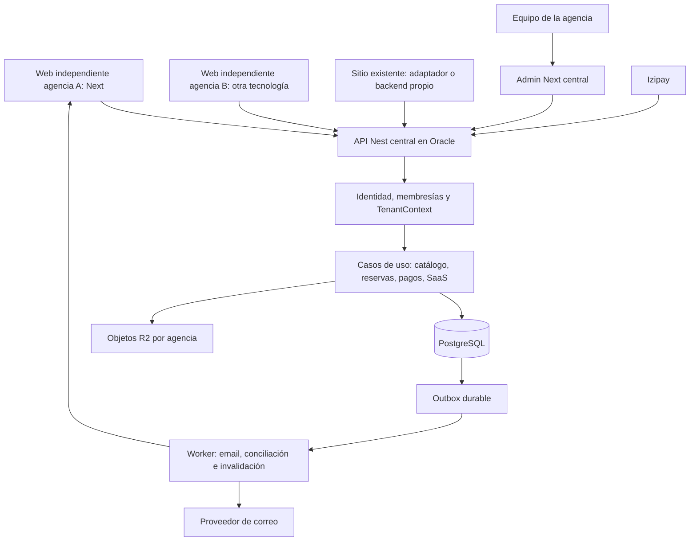

# Plan de arquitectura SaaS y decisión de tecnologías

Fecha: 20 de septiembre de 2026. Basado en la [auditoría del repositorio](./AUDITORIA-SAAS-2026-09-20.md).

**Decisión para la primera versión SaaS: NestJS como backend central y API para todas las agencias, PostgreSQL + Prisma, y Next.js para conservar el panel y la web actuales. Despliegue central en Oracle. Cada agencia podrá usar una web independiente construida por nosotros o conectar su sitio existente.**

El usuario confirmó varias agencias independientes, frontends propios y consumo de la API desde sitios existentes, además de experiencia en marketing/UI/UX sin dominio de estos frameworks y disponibilidad de hosting Oracle. La API es parte del producto desde el inicio. No están confirmados equipo técnico, presupuesto, plazo, tráfico, modelo de cobro ni forma/recursos de la instancia Oracle. El diseño de despliegue asume Oracle Cloud Infrastructure con Linux, pendiente de verificar el servicio concreto.

El alojamiento disponible permite considerar las alternativas sin depender de Vercel, pero no elimina el coste de operar API, base, backups y despliegues. Elegir más tecnologías no simplifica esa responsabilidad. La experiencia UI/UX y marketing puede aprovecharse de inmediato validando onboarding de agencias, claridad del checkout, conversión y tareas del operador; la seguridad, los pagos y la recuperación requieren implementación y revisión técnica.

## Qué resuelve cada tecnología

Next.js y NestJS ocupan papeles diferentes: Next cubre la aplicación React y su capa de servidor; Nest organiza una aplicación backend. Se pueden usar juntos. Next soporta el patrón backend para frontend y puede conectarse a un backend existente. [Documentación de Next](https://nextjs.org/docs/app/guides/backend-for-frontend).

Nest aporta módulos, servicios e inyección de dependencias, útiles para separar reservas, pagos, identidad y agencias. Su adopción implica mantener un servicio y contratos de red adicionales; la organización puede iniciarse antes dentro de paquetes TypeScript. [Módulos Nest](https://docs.nestjs.com/modules).

Vue reemplazaría la capa React. Para la web turística, donde importan catálogo indexable y metadatos, evaluaría Nuxt si se decide ir a Vue; Vue SPA resulta razonable para el panel privado. Vue documenta las ventajas y costes del SSR y recomienda soluciones de nivel superior para ese caso. [SSR en Vue](https://vuejs.org/guide/scaling-up/ssr), [renderizado Nuxt](https://nuxt.com/docs/3.x/guide/concepts/rendering).

## Comparación para este repositorio

| Alternativa | Reutilización | Coste de cambio relativo | Operación | Decisión |
| --- | --- | --- | --- | --- |
| Next.js modular + PostgreSQL + worker | Muy alta | Menor | Dos apps existentes y worker cuando haga falta | Posible técnicamente; no elegida como destino ante el requisito confirmado de API independiente |
| Next.js + NestJS + PostgreSQL | Alta: conserva pantallas, extrae reglas | Medio | API independiente, contratos y worker | Opción elegida para el primer SaaS e integraciones externas |
| Next público + Vue/Vite admin + Nest | Web conservada, panel reescrito | Alto | Dos frameworks frontend, API y worker | Solo si hay una ventaja demostrable del equipo Vue |
| Nuxt público + Vue admin + Nest | Reutiliza principalmente dominio, datos y assets | Muy alto | Rehacer rutas, formularios, estado, SEO y pruebas | No justificado por los hallazgos actuales |
| Next + Fastify directo | Conserva frontend y TypeScript | Medio | Menos estructura impuesta; convenciones propias | Alternativa válida si el equipo prefiere plugins y sabe mantener límites claros |

Fastify proporciona encapsulación mediante plugins, por lo que puede ser una alternativa para organizar el backend; no se atribuye una mejora de rendimiento sin medir este proyecto. [Encapsulación Fastify](https://fastify.dev/docs/latest/Reference/Encapsulation/).

No se observa un motivo concreto para cambiar PostgreSQL por MongoDB, abandonar TypeScript por otro lenguaje o introducir microservicios/Kubernetes. Mantener un monolito modular reduce el número de fronteras que habrá que operar. Prisma puede conservarse; revisar su actualización por separado, con pruebas de migración y compatibilidad, sin unirla obligatoriamente al cambio de backend.

## Decisión de separación del backend

El requisito de alimentar webs independientes y sitios existentes cumple el criterio para separar el backend desde la primera versión SaaS. NestJS alojará autorización, contexto de agencia, catálogo, disponibilidad, cotizaciones, reservas, cobros, integraciones y administración. Los consumidores acceden por contratos HTTP estables, sin depender de Server Actions ni del código React.

Esto no obliga a cambiar el frontend a Vue. Next puede seguir sirviendo el panel y las webs que construyamos, mientras otras agencias utilizan Nuxt, WordPress u otra tecnología capaz de integrar HTTP. La compatibilidad con cada plataforma concreta requiere implementar y probar su adaptador; disponer de una API no instala automáticamente esa integración.

La extracción seguirá siendo gradual, con un módulo dueño de cada escritura. Primero cerrar fallos críticos y crear la base Nest con aislamiento; después conectar el catálogo, panel y checkout. No trasladar las reglas defectuosas actuales sin corregirlas. Mantener un backend modular único y un worker; no crear un backend ni una base separados por cada frontend de manera predeterminada.

La alerta de seguridad de Next exige parchear ahora; no es razón para dejar una versión vulnerable mientras se espera una reescritura.

## Arquitectura SaaS recomendada



Esta es la arquitectura planificada para el SaaS, todavía no implementada. Las conexiones del diagrama son lógicas: pueden pasar por el backend del sitio o, para operaciones públicas limitadas, salir del navegador. Solo API y worker acceden a PostgreSQL en el destino; los frontends consumen contratos. Cada módulo debe tener un único propietario de sus escrituras durante la extracción.

Las webs pueden tener repositorio, dominio y despliegue propios. Para diseños basados en una plantilla común, compartir componentes y configuración reduce mantenimiento sin perder identidad visual. Una web existente puede permanecer en su hosting actual; solo necesita el adaptador y las credenciales adecuadas. No se necesita duplicar el backend por agencia.

Estructura propuesta:

```text
apps/
  web/                 Primera web Next, convertida en consumidor de la API
  admin/               Next.js administrativo
  api/                 Backend central NestJS desde la primera versión SaaS
  worker/              Trabajo durable fuera de la petición HTTP
packages/
  domain/              Reglas puras: dinero, fechas y transiciones
  application/         Casos de uso y puertos de persistencia/proveedores
  contracts/           DTOs y esquemas de entrada/salida sin Prisma
  api-client/          Cliente TypeScript generado a partir de OpenAPI
  db/                  Prisma, migraciones y adaptadores de repositorio
  ui/                  Componentes React realmente compartidos
```

Los componentes no deben recibir modelos completos de Prisma ni credenciales internas. La API expone REST documentada con OpenAPI y cliente tipado. Nest ofrece integración para generar el documento OpenAPI y servir documentación Swagger. [OpenAPI en Nest](https://docs.nestjs.com/openapi/introduction). Server Actions pueden quedar como adaptadores finos; los clientes externos no dependen de ellas. Evitar una API pública GraphQL hasta tener un caso que la necesite.

Para el panel, preferir acceso bajo el mismo origen mediante una capa de servidor/proxy, cookies HttpOnly y validación de origen/CSRF apropiada. La API verifica identidad y membresía: no acepta como autoridad un `agencyId` o `userId` enviado por el navegador. Si se usa una credencial interna entre Next y Nest, validar emisor, audiencia, alcance y rotación; nunca reenviar headers del cliente como si fueran internos.

## API como producto para webs independientes

Separar tres superficies sobre los mismos casos de uso. Los nombres de rutas siguientes son contratos propuestos, no endpoints ya implementados:

| Superficie | Ejemplos v1 | Acceso y alcance |
| --- | --- | --- |
| Pública de la web | `GET /v1/storefronts/{channelId}/tours`, `/transfers`, `/availability` | Solo contenido publicado y disponibilidad vendible; `channelId` público vinculado a una agencia |
| Compra del viajero | `POST /v1/storefronts/{channelId}/quotes`, `POST /v1/checkouts` | Cotización emitida por servidor, controles de abuso e idempotencia; token limitado al checkout creado |
| Integración de servidor | `GET /v1/integrations/reservations`, operaciones habilitadas por permisos | Credencial confidencial revocable, asociada a una agencia e integración concreta |
| Panel | `/v1/admin/tours`, `/v1/admin/reservations`, `/v1/admin/memberships` | Sesión/identidad verificada, membresía vigente y permiso por operación |

Un identificador público de agencia/canal no es un secreto ni una autorización para leer reservas. En la API central, el host será el de la plataforma: no se puede deducir la agencia del host de la API ni confiar en `Origin` o `Referer` para autorizarla. Para catálogo público resolver `channelId`; para integraciones resolverla desde la credencial verificada; para panel comprobar membresía; para comprador verificar el token y su objeto asociado. Rechazar discrepancias con IDs de agencia enviados por cliente.

La web de una agencia puede leer catálogo público desde navegador. Las operaciones privilegiadas deben pasar por un backend/adaptador del sitio: **nunca incluir una API key secreta en JavaScript público**. Para sitios sin backend, ofrecer primero catálogo público y enlace a checkout alojado; después un widget con token de sesión limitado si se necesita incrustación. El acceso a documentos, clientes, cobros manuales o exportaciones nunca se concede mediante la clave pública del canal.

Para las primeras integraciones confidenciales: claves aleatorias de alta entropía, hash almacenado, prefijo identificador, permisos mínimos como `catalog:read` o `reservations:read`, caducidad/rotación/revocación, registro de último uso y cuotas. Una clave pertenece a una agencia e integración, no a toda la plataforma. Si más adelante un tercero debe actuar en nombre de muchas agencias, añadir un flujo estándar de autorización delegada con consentimiento y tokens acotados; no compartir la cuenta del dueño ni fabricar un protocolo OAuth propio.

El contrato debe incluir:

1. Versión `/v1`, OpenAPI publicado, ejemplos sin secretos y cliente TypeScript; integradores no TypeScript utilizan HTTP directamente. Nest soporta versionado por URI y otras estrategias. [Versionado Nest](https://docs.nestjs.com/techniques/versioning).
2. DTOs explícitos, paginación de servidor, fechas/monedas normalizadas, errores con código estable y `requestId`; no exponer modelos Prisma ni errores internos.
3. `Idempotency-Key` para crear checkouts y otras escrituras sensibles, acotada por agencia/cliente/operación, con rechazo de contenido distinto bajo la misma clave.
4. Límites por integración, agencia e IP según la operación; CORS por canales/orígenes autorizados como control del navegador, nunca sustituto de autenticación. No utilizar wildcard con credenciales.
5. Política de compatibilidad: adiciones compatibles dentro de v1, cambios incompatibles en nueva versión, changelog y ventana de transición acordada antes de afectar integraciones.
6. Webhooks de salida como `reservation.created`, `payment.confirmed` y `catalog.updated`, con ID de evento, firma, timestamp, rotación de secreto, reintentos y tolerancia a duplicados/desorden. Entrega al menos una vez; no prometer exactamente una vez. Validar destinos y restringir salida para impedir peticiones a redes privadas/metadata cloud.
7. Sandbox con datos sintéticos, credenciales separadas y pruebas de contrato. Una web con versión anterior compatible debe seguir operando tras actualizar el backend.

La primera aceptación de esta API exige dos consumidores independientes y dos agencias: convertir la web Next existente y construir una integración mínima de referencia con HTTP genérico. Si la primera agencia externa usa WordPress u otra plataforma, estimar su adaptador por separado según ese entorno. Probar reservas completas, rotación de credenciales y aislamiento, además de mostrar tours.

## Diseño de agencias, identidad y datos

Modelo inicial recomendado: base y esquema compartidos con `agencyId` obligatorio en entidades de agencia. Los registros de plataforma se modelan separadamente, sin interpretar `agencyId = null` como permiso global. Base por agencia quedaría para necesidades contractuales específicas de aislamiento o restauración, por su coste operativo.

Entidades principales:

| Entidad | Responsabilidad |
| --- | --- |
| Agency | Identidad, estado, zona horaria, moneda y configuración |
| User | Identidad global de una persona |
| Membership | Relación usuario/agencia, rol y estado; única por ambos IDs |
| PlatformRole | Administración de plataforma separada de roles de agencia |
| AgencyDomain | Dominio normalizado, verificación, estado y certificado |
| StorefrontChannel | Canal público, agencia, configuración y orígenes permitidos |
| Integration / ApiCredential | Cliente externo, agencia, permisos, hash de clave y revocación |
| WebhookSubscription / WebhookDelivery | Destino verificado, eventos, firma y entregas/reintentos |
| Plan / Subscription / Entitlement | Contrato SaaS y capacidades habilitadas |
| PaymentProviderAccount | Cuenta de cobro por agencia, modo y referencia segura a secretos |
| Reservation u Order | Autoridad comercial elegida, con líneas y snapshots |
| PaymentAttempt / PaymentEvent | Intención, referencia de proveedor y recepción idempotente |
| OutboxEvent / Delivery | Efectos posteriores con reintentos observables |
| InventoryHold | Cupo reservado temporalmente y vencimiento |
| CouponRedemption | Reserva/consumo/liberación de cupón por checkout |
| AuditEvent | Actor, agencia, objeto, acción y cambios con política de retención |

Reutilizar modelos existentes cuando encajen; no añadir una tercera representación de reservas por comodidad. Determinar si `Order` será agregado comercial canónico antes de activarlo y documentar cómo se vincula con `Reservation` histórica.

Reglas de aislamiento:

1. En el panel, obtener agencia seleccionada y comprobar membresía activa en servidor. En webs alojadas por la plataforma, resolver dominio verificado; en la API, usar canal público o credencial/identidad verificada según la superficie. Rechazar host/canal desconocido y no confiar en `X-Forwarded-Host`, `Origin` o un `agencyId` como autorización.
2. Exigir `TenantContext` en cada caso de uso. Validar pertenencia también en IDs de categorías, vehículos, cupones y operadores relacionados.
3. Sustituir unicidad global por `(agencyId, slug)` y `(agencyId, code)` donde corresponda. La unicidad global del email puede conservarse con identidad global y membresías.
4. Aislar cachés, archivos, jobs, exportaciones y métricas igual que las tablas. Dar contexto de agencia explícito a los workers.
5. Separar acceso de soporte/plataforma del acceso normal, con permisos y auditoría. Nunca implementar un bypass general a partir de un rol recibido del cliente.
6. Añadir RLS como defensa adicional cuando el flujo de conexiones esté probado. Con pools, aplicar contexto local a la transacción; evitar que una conexión reutilizada arrastre la agencia anterior. El usuario de aplicación no debe ser superusuario ni tener BYPASSRLS; considerar FORCE RLS para el propietario. PostgreSQL documenta estas excepciones en sus [políticas de seguridad por fila](https://www.postgresql.org/docs/current/ddl-rowsecurity.html).

Una extensión Prisma que añade filtros no basta por sí sola: revisar escrituras anidadas, relaciones, SQL crudo, operaciones bulk y cualquier acceso fuera del repositorio autorizado.

## Reservas, dinero y procesos durables

Definir el dinero como `{ amountMinor, currency }`, con exponentes y redondeo explícitos para las monedas soportadas. Evitar floats en cálculo y persistencia financiera. Las tasas pueden expresarse en puntos básicos; los snapshots conservan precio, impuestos, comisiones y política que el viajero aceptó.

Separar estado comercial —pendiente, confirmado, cancelado— del financiero —pendiente, parcialmente pagado, pagado, reembolso pendiente, etc.— con transiciones permitidas y eventos auditados. Una cancelación no equivale automáticamente a un reembolso; un registro manual de cobro requiere importe, actor, referencia y motivo.

Flujo propuesto:

1. Cotizar en servidor por agencia, servicio, fecha y modalidad, verificando inventario y tarifas reales.
2. Crear checkout idempotente; misma clave y mismo contenido devuelve el resultado existente, misma clave con contenido distinto se rechaza.
3. En una transacción breve, reservar cupo/cupón y persistir intención e importe.
4. Crear intento en el proveedor fuera de la transacción, con timeout y manejo de respuesta ambigua; reconciliar antes de duplicar un intento.
5. Verificar IPN y persistir evento con unicidad por proveedor/cuenta/identificador; validar importe, moneda, ambiente y pertenencia.
6. Aplicar transición e insertar outbox en la misma transacción. El worker envía correo y otras notificaciones con deduplicación.
7. Expirar holds y resolver pagos tardíos/discrepancias mediante reglas explícitas; conciliar periódicamente contra el proveedor.

Para comenzar, outbox y worker sobre PostgreSQL pueden evitar otra dependencia de infraestructura. Si el volumen o los trabajos programados lo justifican, usar Redis/BullMQ con outbox conservado para no perder el enlace transaccional. Nest integra BullMQ, cuyos trabajos deben diseñarse para reintentos. [Colas Nest](https://docs.nestjs.com/techniques/queues).

## SaaS como producto

El pago de un tour y el pago de la suscripción de una agencia son dominios distintos. Izipay integrado para viajeros no constituye por sí mismo facturación SaaS.

Para el primer piloto: alta asistida de agencia, invitación del dueño, membresías, catálogo, marca, cobro por cuenta configurada, plan y límites efectivos. El cobro de suscripción puede registrarse manualmente con auditoría durante el piloto si el negocio lo admite; no mostrar autoservicio de suscripción como completado sin implementarlo.

Para autoservicio comercial: prueba, activación, renovación, mora, suspensión, cancelación, cambio de plan, prorrateo si aplica, portal de facturación, eventos idempotentes y exportación al salir. Las cuotas de usuarios, medios y operaciones deben imponerse en backend; suspender ventas nuevas no debería impedir procesar un IPN ya pendiente ni recuperar datos del cliente.

Las reglas técnicas de datos deben incluir minimización de documentos, acceso por función, redacción de logs, retención configurable, exportación/borrado con excepciones financieras y registro de consentimientos/bajas. Los textos legales y contratos se validarán por mercado; esta planificación no confirma cumplimiento legal.

## Despliegue previsto en Oracle

Oracle dispone de instancias x86 y Arm; primero inventariar arquitectura, CPU, RAM, disco, región, sistema y red. Eso condiciona las imágenes y los binarios nativos de Prisma/Sharp. No se presupone capacidad ni gratuidad a partir de decir “hosting Oracle”. [Formas de cómputo OCI](https://docs.oracle.com/en-us/iaas/Content/Compute/References/computeshapes.htm).

Para un piloto pequeño, con recursos verificados, una VM Linux puede alojar proxy, API Nest, panel Next, primera web y worker, con límites de recursos y reinicio supervisado. Las demás webs pueden desplegarse por separado, también fuera de Oracle. Es una propuesta que debe someterse a carga, no una garantía de capacidad. Preferir base en instancia privada separada o servicio PostgreSQL gestionado si hay presupuesto y disponibilidad; alojarla en la misma VM solo como compromiso de piloto, con volumen persistente y recuperación externa ensayada. Una sola VM constituye un punto único de fallo.

| Elemento | Decisión propuesta |
| --- | --- |
| Entrada | Proxy inverso con TLS; público HTTPS, HTTP solo para redirección/certificados si aplica |
| Servicios | Docker Compose para API Nest, admin, primera web y worker; Redis según necesidad |
| Puertos internos | Puertos de procesos y PostgreSQL sin exposición directa; API accesible por HTTPS a través del proxy |
| Red OCI | Reglas NSG/security lists y firewall del sistema coherentes; no publicar la BD |
| Dominios iniciales | Panel en dominio central y subdominios por agencia; dominios propios después de verificar propiedad |
| Construcción | Imagen por aplicación en CI para la arquitectura de destino; instalación congelada y runner no root |
| Release | Migración única, arranque sin seed, health/readiness y smoke checks; conservar imagen anterior |
| Secretos | Inyectados al ejecutar desde un gestor o archivos protegidos; nunca copiados al build ni almacenados en Git |
| Medios | Mantener R2 inicialmente por integración existente; cambiar a OCI Object Storage solo con razón de coste/operación y prueba del adaptador |
| Backups | PostgreSQL con política de backup y, si se requiere, archivado WAL; copia fuera de la VM y prueba de restauración |
| Observación | Uptime, uso de disco/RAM, errores, pagos sin conciliar, fallos de correo y antigüedad del último backup |
| Staging | BD y credenciales de prueba separadas; no apuntar desarrollo o simulador de pago a producción |

La documentación de Next recomienda un proxy inverso para self-hosting y explica los requisitos de coordinación de caché al usar varias instancias. Empezar con una réplica por app, resolver invalidación API→webs mediante eventos y diseñar caché compartida antes de multiplicar réplicas. [Next self-hosting](https://nextjs.org/docs/app/guides/self-hosting). Las reglas de red deben revisarse también en OCI, no solo dentro de Docker. [Reglas de seguridad OCI](https://docs.oracle.com/en-us/iaas/Content/Network/Concepts/securityrules.htm).

No se accedió a la cuenta de Oracle ni se cambió su configuración. CPU/RAM, backups efectivos, exposición actual, DNS y coste total quedan por inventariar antes del despliegue. Tener la VM no elimina gastos de almacenamiento, correo, backups, dominios ni trabajo operativo; no se ha cotizado ningún proveedor.

## Ejecución por fases

Estimaciones orientativas en **días-persona**, no promesa de calendario ni estimación de tu tiempo aprendiendo programación. Suponen un responsable técnico con experiencia en TypeScript y acceso a staging/proveedor sandbox; excluyen rediseño visual completo, app móvil, marketplace y facturación fiscal avanzada. Reestimar tras la fase 0. Añadir margen del 25–40 % según incertidumbre de datos y proveedores.

| Fase | Trabajo y dependencia | Estimación | Criterio de salida |
| --- | --- | --- | --- |
| 0. Base segura | Corregir A02–A09, parchear dependencias, bootstrap seguro y aislar staging | 5–10 | Sin seeds en arranque; revocación/roles/resultado privado y serialización seguros; CI básico verde |
| 1. Base Nest y contratos | API, OpenAPI v1, CI, migraciones baseline, dominio y autoridad de reservas | 8–15 | API desplegable con contratos; representación financiera definida; migración ensayada |
| 2. Aislamiento SaaS | Membresías, TenantContext, backfill, restricciones, dominios y cachés | 10–20 | Dos agencias pasan matriz de aislamiento, incluyendo relaciones, medios y jobs |
| 3. Catálogo y consumidores | Extraer catálogo a Nest; conectar Next/panel; cliente tipado, canal e integración HTTP de referencia | 5–10 | Dos frontends independientes consumen catálogo aislado sin acceso directo a BD |
| 4. Cobro fiable en Nest | Extraer reservas/pagos; idempotencia, capacidad, cupones, outbox y conciliación | 10–20 | Sandbox supera pagos duplicados, tardíos y fallos; dinero conciliado; escritores antiguos retirados |
| 5. Integraciones y piloto | Claves/permisos, webhooks, onboarding, planes/límites, correo real, Oracle y recuperación | 13–25 | Agencia piloto vende y opera; integrador externo completa compra; rotación, restore y rollback demostrados |
| 6. SaaS autoservicio | Cobro recurrente, dominios automatizados, upgrades/mora/exportación | 10–20 adicionales | Ciclo comercial completo e idempotente, con métricas y soporte |

Fases 0–5: aproximadamente **51–100 días-persona antes del margen**, incluyendo backend independiente e integración de referencia. Excluye construir un frontend personalizado completo para cada agencia y adaptadores comerciales para todas las plataformas. Dos desarrolladores pueden repartir frontend, backend y pruebas, pero las dependencias de datos y proveedores impiden dividir automáticamente el plazo entre dos.

Primer lote concreto de trabajo:

| Ticket | Resultado verificable | Hallazgos |
| --- | --- | --- |
| SAFE-01 | Start solo arranca; seeds de demo bloqueados en producción y sin impresión de claves | A02–A03 |
| SAFE-02 | Next y árbol de imágenes corregidos; audit clasificado y pruebas de rutas sensibles | A04 |
| AUTH-01 | Token previo rechazado tras baja, cambio de rol, contraseña o revocación | A05 |
| AUTH-02 | Permisos por operación; MASTER no modifica SUPERADMIN por rutas alternativas | A08–A09 |
| DATA-01 | Resultado de reserva exige acceso y entrega un DTO sin documentos/token de pago | A06 |
| WEB-01 | JSON-LD serializado de forma segura; carga de imágenes restringida | A07, A20 |
| OPS-01 | CI, variables, Docker mínimo y primera migración reproducible | A18–A19, A26 |
| API-01 | Nest con OpenAPI v1, autenticación y TenantContext; pruebas de dos agencias | A01, A17 |
| API-02 | Catálogo publicado para web independiente y credenciales confidenciales con permisos | Requisito confirmado de integraciones |
| PAY-01 | Estado y moneda canónicos con tests sobre webhook realista | A10, A14, A16 |

En un equipo de una persona, seguir esa secuencia salvo que la aplicación ya esté expuesta: en ese caso los parches críticos y el cierre temporal de la superficie vulnerable se priorizan el mismo día, antes de nuevos clientes.

## Migración incremental a NestJS

1. Congelar contratos externos y escribir pruebas de comportamiento sobre los casos de uso corregidos. Extraer reglas TypeScript sin dependencias de Next.
2. Crear `apps/api` con configuración validada, autenticación, tenant, logging, health y OpenAPI. Mantener inicialmente la misma base con roles de acceso controlados.
3. Migrar un módulo de catálogo de bajo riesgo. Comparar respuestas de lectura y tiempos con fixtures; evitar duplicar escrituras.
4. Trasladar reservas y pagos como un bloque coherente cuando estén probados; conservar ruta pública del webhook mediante proxy si hace falta y reutilizar registro de idempotencia.
5. Convertir acciones Next en clientes del caso de uso remoto; retirar acceso Prisma directo del módulo migrado. No dejar dos implementaciones activas del precio o estado.
6. Migrar notificaciones, medios y administración; activar por agencia piloto mediante bandera. Medir errores, conciliación, latencia y operación.
7. Eliminar el camino antiguo después del periodo de verificación y de resolver pagos/intentos pendientes de la versión anterior.

Rollback: durante la transición, esquema aditivo y compatible, releases con versión y copia de seguridad verificada. Revertir frontend/API solo si la versión anterior comprende las nuevas escrituras. No regresar al checkout inseguro ni ejecutar migraciones destructivas de reversión. Ante incompatibilidad financiera, detener nuevos cobros y hacer corrección hacia adelante conservando eventos y conciliación.

## Migración de datos sin perder información

1. Inventariar datos reales en una copia: nulos de agencia, relaciones cruzadas, duplicados, reservas sin código, moneda y estados históricos. No asignar indiscriminadamente todo huérfano a una agencia si ya hubo varios clientes.
2. Crear baseline de migraciones y backups con restauración ensayada. Añadir campos/tablas sin eliminar todavía los existentes.
3. Backfill por lotes con reglas explícitas de propiedad. Separar usuarios de plataforma y membresías. Mantener tabla de correspondencia cuando se introduzca Order.
4. Convertir dinero con redondeo acordado y conservar valor original para conciliación. Separar estados desconocidos de pagos comprobados.
5. Comparar conteos por agencia, totales por moneda/estado, relaciones y muestras de reservas. Investigar cada diferencia.
6. Imponer restricciones e índices después de verificar la limpieza. Cambiar escritores una sola vez por módulo y observar.
7. Retirar columnas/modelos antiguos en una release posterior, cuando ningún consumidor ni evento pendiente los necesite.

## Pruebas que autorizan técnicamente el piloto

| Área | Casos obligatorios |
| --- | --- |
| Aislamiento | Agencia A no lista, modifica, relaciona, exporta ni descarga recursos B; host desconocido rechazado; caché sin mezcla |
| Roles | Matriz de permisos sobre las acciones/API reales; cambios de rol y revocación inmediatos; soporte auditado |
| Comprador | Reserva ajena rechazada; enlaces expirados/revocados; DTO sin PII innecesaria |
| Checkout | Manipulación de precio, fecha pasada, modalidad desactivada, vehículo incompatible, cupón inválido y reintento |
| Concurrencia | Dos compras por el último cupo/último cupón; no sobreventa ni consumo doble |
| Pagos | Firma incorrecta, cuenta/moneda/monto incorrectos, duplicado, orden alterado, respuesta ambigua, pago tardío y cancelado |
| Efectos externos | Caída del correo/worker, reintento sin duplicación y recuperación del outbox |
| Datos | Backfill/constraints en copia; estados históricos conciliados; migración compatible entre releases |
| Operación | Instalación congelada, lint/tipos/tests/build, logs sin secretos, restore, rollback y despliegue de ambas apps |
| Frontend | Compra y operación en móvil/escritorio; teclado/foco/formularios; SEO y contenido tras actualización del admin |
| SaaS | Cuotas en backend, suspensión, exportación y continuidad de eventos de pago pendientes |
| Integraciones | Dos consumidores independientes; API key revocada rechazada; permisos mínimos; cambio de agencia rechazado; compatibilidad v1; webhook firmado con duplicados/reintentos |

Usar PostgreSQL desechable para integración y proveedores simulados/sandbox; la suite actual de helpers no reemplaza estos escenarios. Medir carga sobre un volumen acordado y definir SLO/RPO/RTO a partir de los compromisos comerciales, sin prometer cifras basadas solo en el framework.

## Si se elige Vue más adelante

Primero estabilizar API y contratos; después migrar una pantalla representativa del panel con formularios, tabla y permisos. Comparar esfuerzo de implementación, defectos, accesibilidad y mantenimiento con la pantalla React equivalente. Si el beneficio es claro, migrar rutas del panel progresivamente detrás del mismo origen.

Conservar Next en la web mientras dure esa prueba. Una sustitución de la web pública debe evaluar Nuxt, preservar URLs/canonical/sitemap/metadatos, mantener contenido renderizado para buscadores y probar carrito, pasarela y consentimiento. React/Base UI/Recharts/Zustand/componentes TSX no se convierten automáticamente a Vue; CSS, assets y reglas TypeScript puras sí pueden aprovecharse en parte.

## Decisiones comerciales aún por concretar

Ya están confirmados agencias independientes, frontends propios, integración de webs existentes por API, backend Nest, tu perfil de producto y alojamiento Oracle. El plan puede empezar por seguridad y base API sin más decisiones. Antes de definir cobro y capacidad hay que acordar: cuenta de cobro de cada agencia vs cobro centralizado; responsable técnico disponible; plazo/presupuesto; países/monedas/idiomas; primera plataforma externa a integrar y volumen esperado; recursos de Oracle y requisitos de recuperación. Si se elige cobro centralizado, reestimar liquidaciones, comisiones, disputas y requisitos del proveedor antes de reutilizar este modelo de pagos.
